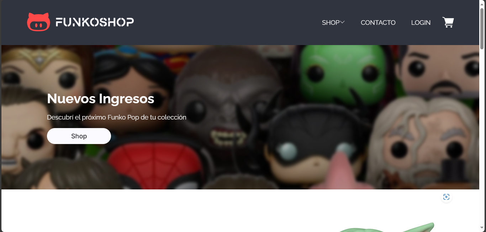

<br/>
<p align="center">
  <a href="https://github.com/ArriolaMatias/FunkoShop-CaC">
    
  </a>
  
  ---

  <h3 align="center">Funkoshop Store</h3>

  <p align="center">
    E-commerce realizado como proyecto final del programa Codo a Codo.
    <br/>
    <br/>
  </p>
</p>

 

<a href="/README.md"> Documentación en inglés </a>

## Tabla de contenidos

- [Tabla de contenidos](#tabla-de-contenidos)
- [Acerca del proyecto](#acerca-del-proyecto)
- [Desarrollado con](#desarrollado-con)
- [Primeros pasos](#primeros-pasos)
  - [Prerequisitos](#prerequisitos)
  - [Node](#node)
- [Instalacion](#instalacion)
- [Uso](#uso)
- [Autores](#autores)

## Acerca del proyecto



[ Descripción del proyecto ]

## Desarrollado con


## Primeros pasos

Este es un ejemplo de como deberías de configurar el proyecto para utilizarlo localmente. 
Para obtener el contenido de este repositorio, solamente segui estos pasos: 

```
    $ git clone https://github.com/ArriolaMatias/FunkoShop-CaC
```

### Prerequisitos

### Node
- #### Instalacion de Node en Windows

Simplemente ingresa al [sitio oficial de Node.js](https://nodejs.org/) y descargá el instalador.
Además, asegurate de tener `git` correctamente instalado y configurado en el PATH de tu equipo, ya que es necesario para utilizar `npm` (Podes encontrarlo [acá](https://git-scm.com/))

- #### Instalacion de Node en Ubuntu

  Podes instalar NodeJS y npm facilmente utilizando `apt install`. Simplemente deberías correr los siguientes comandos:

```
      $ sudo apt install nodejs
      $ sudo apt install npm
```

- #### Otros sistemas operativos
  Podes encontrar más información acerca de como instalar node y npm en sus sitios web oficiales: 
  * [Sitio oficial de Node.js](https://nodejs.org/) 
  * [Sitio ofical de npm](https://npmjs.org/).

Si la instalación fue exitosa, deberías poder correr el siguiente comando:
```
    $ node --version
    v8.11.3

    $ npm --version
    6.1.0
```

Si necesitas actualizar `npm`, podes correr el comando `npm`. Luego, solo deberias cerrar y volver a abrir la linea de comandos para ver los resultados.

```
    $ npm install npm -g
```

## Instalacion
```
    $ cd FunkoShop-CaC
    $ npm install
```

## Uso

```
    $ npm start
```

## Autores

* **Victoria Demkoff** - [Victoria Demkoff](https://github.com/vickydemkoff)
* **Matías Arriola** - [Matías Arriola](https://github.com/ArriolaMatias)
* **Hernán Cifalá** - [Hernán Cifalá](https://github.com/Hernan-Cifala)
* **Lucas Colque** - [Lucas Colque](https://github.com/lucasColque)
* **Damian Setimmo** - [Damian Setimmo](https://github.com/damisettimo)